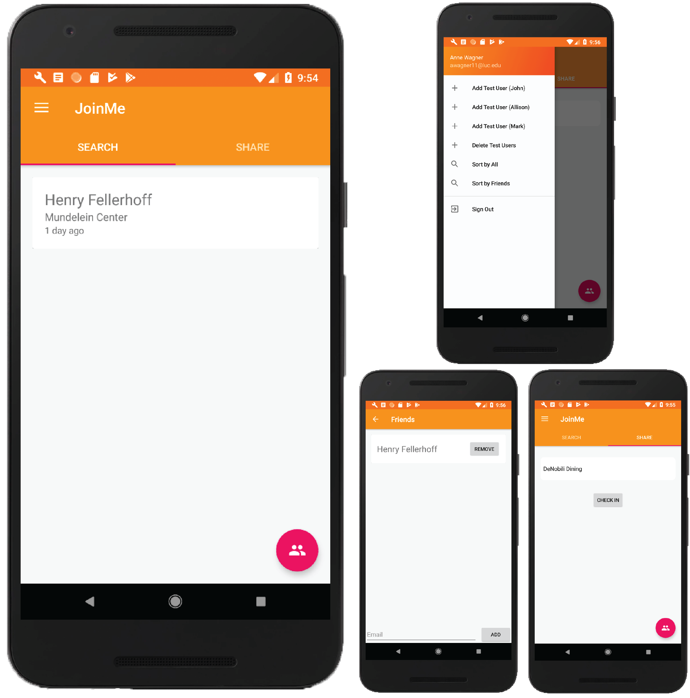

    

<h1 align='center'>
    JoinMe – Android App Prototype
</h1>
An android app prototype of an app called JoinMe, which connects friends and creates a seamless way to meet up informally.
JoinMe is an Android app which allows users to connect with and meet up with friends at various locations around campus. The app creates a platform for users to share their location and invite friends to join them, enabling more face-to-face interaction with friends and breaking down the barriers of informally hanging out. The app has a friends function, which makes it easier for the user to find specific people to hang out, rather than being exposed to the entire Loyola population. The app removes the hassle of texting and contacting a number of friends just for a brief hang out, and instead makes it quick and easy to meet up with friends and classmates.

### Participants
- Henry Fellerhoff
- Anne Wagner
- Yilin Guan
- Amad Farooq

### Roles
We used the GitHub project tab (similar to Trello) to assign development steps on an individual task basis. Each team member was involved in some way about the app research and development so that everyone could have a complete understanding of the app creation.
			
### Project Design
This project primarily employs Android Studio for app development, as well as the built-in emulator for app testing. Our team developed the app in Java, as well as worked with the necessary xml files essential to creating an android application. Google Firebase is used in the app and externally as a database, as well as for user authentication. The expected hardware is Android devices, although porting the app to iOS devices as well would be ideal. Using the location of the user is something on our list of stretch goals, and as a result we may utilize the location information from the phone and possibly Google Maps data.

### General Development Timeline
1) Actual Development Starts
2) Initial framework for app, where interfaces are laid out but have very limited implementation
3) UI updates/finalization before implementation, implemented authentication
4) Email only at the minute, design decision to leave out Google due to roadblocks
5) Basic database interaction/implementation
6) Share Tab implemented, allows for location sharing
7) Search Tab implemented, now displays location reports
8) Various improvements to above before moving forward with friends system
9) Friends system basics implemented, database storage and adding
10) Friends display/alphabetical sorting implemented, minor tweaks/fixes
11) Sort by friends implemented in Search tab
12) Minor bug fixes/code cleanup
13) Project Due
